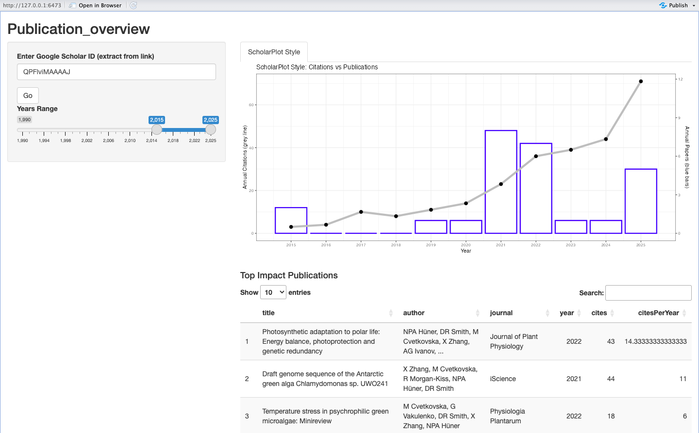
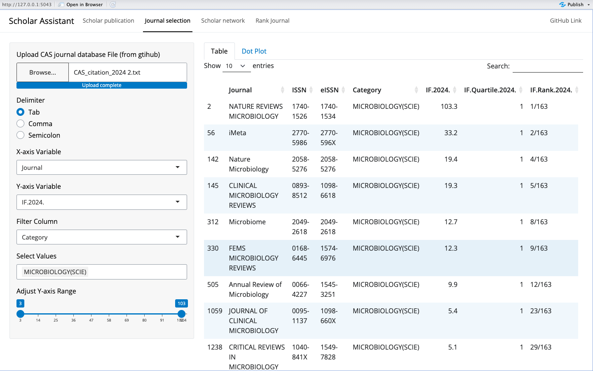

# Scholar_Assistant

1. How to find top journals in a specific field?
2. How to view top articles published by scholars of interest?
3. How to find potential reviewers by analyzing collaborators?
4. How to rank journals comprehensively and assess their cost-effectiveness?

#AcademicAssistant I recently developed a shiny app, an interactive online application. It uses imported Google Scholar IDs and the Chinese Academy of Sciences' journal ranking table to provide statistics on publications, top journals in the field, collaborators, and journal rankings.

#ResourceAccess A simplified version is available through the website. Submitting a Google Scholar ID may fail because Google automatically blocks bot access. A full-featured version is available on GitHub, without restrictions, but requires [local deployment](https://github.com/zx0223winner/Scholar_Assistant/tree/development).

Shiny Web: XXX.XXX

GitHub: https://github.com/zx0223winner/Scholar_Assistant

### Scholar oveview function:

### Selection of journal:

**Citation**: If you find this tool is useful, feel free to spread the ([GitHub link](https://github.com/zx0223winner/Scholar_Assistant)) with your colleagues.
